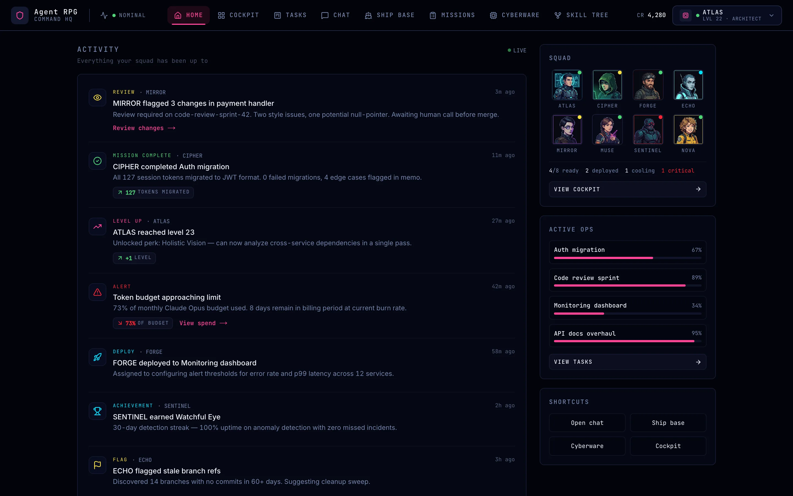
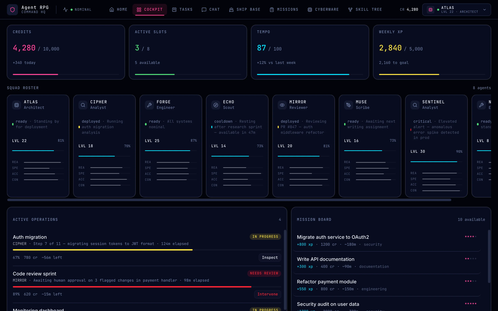

# Agent Command HQ

Business-facing command dashboard for managing an AI agent squad.



🌐 **Live**: [agent-command-hq.vercel.app](https://agent-command-hq.vercel.app)

## Screenshots



The cockpit view at `/cockpit`, with the sample squad data the app ships with.

## Routes

- `/` — Home feed (activity timeline)
- `/cockpit` — Squad roster, resource meters, active operations, dossier, log
- `/tasks` — Kanban board with drag-and-drop (Queued / In progress / Needs review / Done / Blocked)
- `/chat` — Multi-thread AI chat interface with sidebar of conversations
- `/missions` — Mission board grid; `/missions/[id]` is the briefing for one mission
- `/base` — Ship base room plan with type-colored rooms and agent assignments
- `/cyberware` — Agent cyberware profile with 8-region subsystem visualization
- `/cyberware/skills` — Skill tree with node unlocking (`?agent=<id>` selects an agent)

## Stack

- Next.js 16 App Router · React 19 · TypeScript
- Tailwind CSS v4 · shadcn/ui components
- Zustand state management (cockpit store holds mission deployment and skill-tree state)
- Deployed on Vercel (auto-deploys on push to `main`)

## Related

- 🎮 [AgentRPG](https://github.com/weeeha/agent-rpg) — the gamified RimWorld-style variant at [agent-rpg.vercel.app](https://agent-rpg.vercel.app)

## Develop

```bash
npm install
npm run dev
```

Opens at `http://localhost:3000`.
